# Documentation de l'Architecture du Pipeline de Données

Basée sur le diagramme, voici une documentation complète de l'architecture de pipeline de données qui implique l'extraction de données depuis quelques sources différentes, leur chargement dans S3 et leur transformation dans DuckDB.

⚠️ Attention: local cache et local cache geo, les deux sont le même emplacement: database/cache, c'est juste pour simplifier la représentation du schéma que je les ai séparés.

### Composants du Système

1. **Sources de Données**

   - cinque sources de données distinctes provonant de site d'intenet fournissent des informations brutes au pipeline

   1. https://www.data.gouv.fr/fr/datasets/resultats-du-controle-sanitaire-de-leau-distribuee-commune-par-commune/
   2. https://public.opendatasoft.com/api/explore/v2.1/catalog/datasets/
   3. https://www.insee.fr/fr/statistiques/fichier/7766585/v_commune_2024.csv
   4. https://datanova.laposte.fr/data-fair/api/v1/datasets/laposte-hexasmal/metadata-attachments/base-officielle-codes-postaux.csv
   5. https://catalogue.atlasante.fr/geosource/panierDownloadFrontalParametrage/d51b5c43-812d-420f-a641-83e18ddb8628

   - Ces sources inclure principalement des bases de données de public, des API, des fichiers manuellement telechargés et transforme à local

2. **Couche de Stockage**

   - Amazon S3 sert de couche de stockage principale, il fonctionne comme un lac de données pour les données brutes et traitées
   - DuckDB fonctionne comme l'entrepôt de données principal et gère le cycle de vie de DB
   - une cache dans database folder sert comme un endroit de stockage temporairement des données

3. **Flux de Données**
   - Les processus d'extraction(download_file_from_https) récupèrent les données des sources
   - Les données sont chargées dans S3 dans leur format brut ou tranformées
   - Les processors lisent depuis le cache et DuckDB et ensuite effectuent des transformations.
   - Les données transformées sont mises à disposition pour l'analyse avec DBT ou pour la consommation de DEV

## Description Détaillée des Composants

### Entrepôt de Données DuckDB

DuckDB est utilisé comme solution d'entrepôt de données avec ces fonctionnalités :

- **Base de Données Analytique In-process** : Optimisée pour les charges de travail OLAP
- **Interface SQL** : Fournit une syntaxe SQL familière pour les transformations
- **Plugin Geographique** : Permet de stocker les informations geometry ou géographie
- **Faibles Exigences en Ressources** : Fonctionne avec une infrastructure minimale

## Détails des Composants du Code

1. Pipeline/tasks/client
   - Chaque source correspond à un client dédié qui gère le cycle de vie complet des données
   - Les clients encapsulent la logique spécifique à chaque source
2. Pipeline/tasks/\*.processor
   - Contient les processeurs de transformation pour chaque type de données
   - Implémente la logique métier pour convertir les données brutes en données exploitables
3. Pipeline/tasks/client/Core
   - Définit les classes de base pour les capacités d'extraction, d'ingestion et d'interaction avec la base de données
   - Fournit des abstractions réutilisables pour toutes les sources
4. Pipeline/tasks/config
   - Contient les configurations pour l'ensemble du pipeline/tasks
   - Divisé en configuration commune et configurations spécifiques à chaque source
5. Pipeline/tasks/build_database
   - Script pour construire et initialiser la base de données DuckDB
6. Pipeline/Run.py
   - Point d'entrée principal définissant les commandes CLI
   - Permet l'exécution de différentes parties du pipeline
7. .github/workflows
   - Contient les définitions CI/CD pour l'automatisation et des tests pour chaque PR

### Intersection

## Intersection avec DA

Nous utilisons DBT pour la solution de data lineage, tests, et documentation.
L'équipe de Data Engineering a principalement installé l'outil et mis en place des modèles source et staging(models/sources et models/staging). Les modèles intermédiaires (models/intermediate) sont créés par les Data Analysts à partir des tables de staging.
Nous avons déployé la documentation avec GitHub Pages. Voici le lien public pour consulter la documentation de notre base de données : https://dataforgood.fr/13_pollution_eau/#!/overview

## Intersection avec DEV

L'équipe de développement a besoin de fichiers PMtiles pour contenir les informations géographiques de la carte ainsi que les résultats des analyses sur la qualité de l'eau. L'équipe de Data Engineering a la responsabilité de fournir un endpoint pour télécharger le fichier PMtiles. Ce fichier PMtiles est créé par generate*pmtiles.py avec les modèles créés par les Data Analysts (dans le dossier dbt*/models/website).

### Extra

vous trouvez également une partie de documentation dans Readme.md du project
